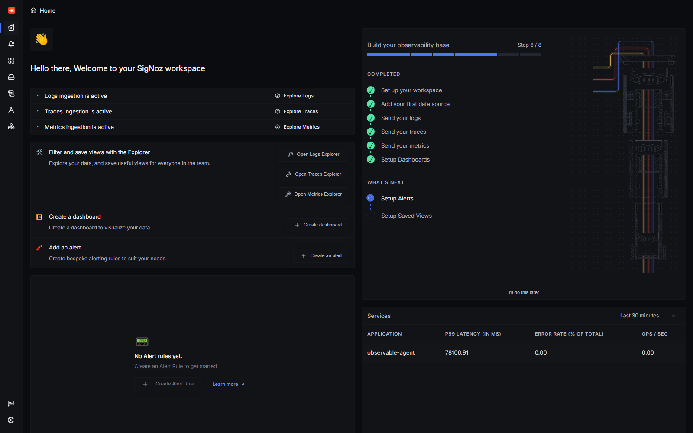
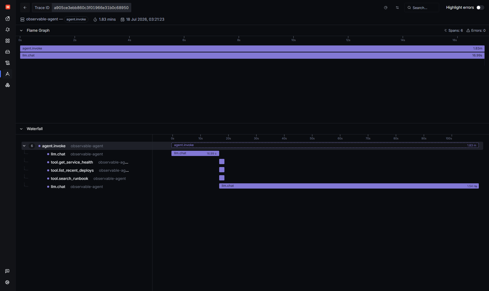
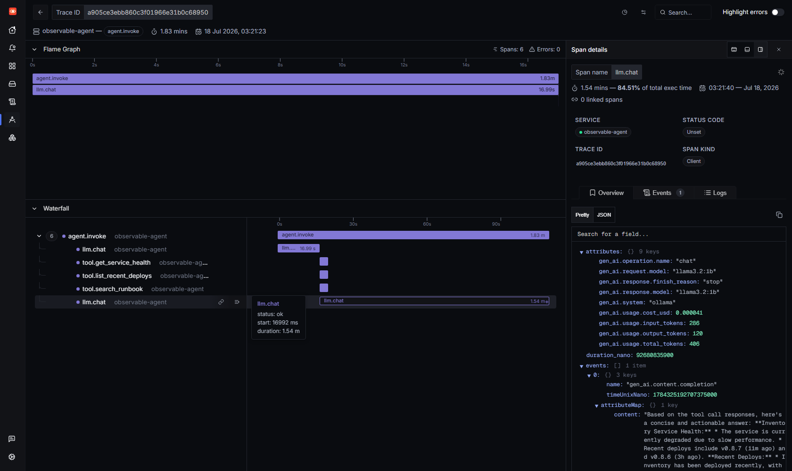
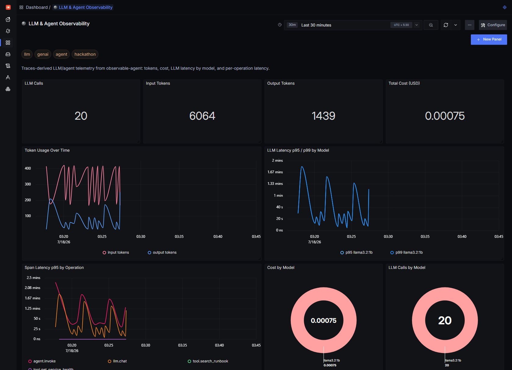

# I gave a local Llama agent OpenTelemetry eyes

> "If you can't observe your AI agents, you don't own them."

That line from the *Agents of SigNoz* hackathon stuck with me, so I tested it literally. I took a small SRE "sidekick" agent running on a **local Llama model**, with no OpenAI bill and no vendor dashboard, wired it up with **OpenTelemetry**, and pointed it at a **self hosted SigNoz**. Then I watched what an agent actually does when you ask it a question.

The short version: the tool calls were never the problem. **One LLM call was 84.5% of the entire request.** I only know that number because the agent had eyes.

This post is the narrow, practical walkthrough: self host SigNoz, instrument an agent with the OpenTelemetry **GenAI semantic conventions**, and read the trace, tokens, cost, and latency tail that come out the other side.

---

## The stack (all local, all free)

| Piece | What I used |
|---|---|
| Observability backend | **SigNoz v0.133** (self hosted via Foundry) |
| Telemetry | **OpenTelemetry Python SDK** (manual spans + metrics + logs) |
| Transport | OTLP/HTTP → `:4318` |
| LLM | **Ollama** running `llama3.2:1b` and `llama3.2:3b` on CPU |
| Agent | ~200 lines of Python: a tool calling loop |

Heads up if you're following an old tutorial: the `install.sh` script and the bundled `docker-compose` files are **deprecated as of v0.130**. SigNoz now installs through **Foundry**, a small "observability stack as code" CLI. It's still three steps:

```bash
# 1. install the Foundry CLI
curl -fsSL https://signoz.io/foundry.sh | bash

# 2. a five line casting.yaml (this is the whole file)
#   apiVersion: v1alpha1
#   kind: Installation
#   metadata: { name: signoz }
#   spec: { deployment: { flavor: compose, mode: docker } }

# 3. deploy
foundryctl cast -f casting.yaml
```

I'm on Windows, so I ran everything inside **WSL 2 with Docker Engine**, not Docker Desktop. That's not a personal quirk: SigNoz's own docs warn that ClickHouse Keeper crash loops (exit 139, segfaults) under Docker Desktop's VM layer on Windows. I hit exactly that before switching, so consider this your warning too.

A minute later the UI is on `http://localhost:8080`, and its onboarding checklist lights up green the moment your app starts sending data:



Three ticks, **logs, traces, and metrics ingestion active**, and my service `observable-agent` shows up in the services list. That's the whole "did my telemetry land?" question answered in one screen.

---

## The agent: a tiny SRE sidekick

The agent answers on call questions like *"Is checkout healthy?"* or *"What's my error budget?"*. It has four tools:

- `get_service_health(service)`
- `list_recent_deploys(service)`
- `calculate_error_budget(slo_percent, actual_error_rate)`
- `search_runbook(topic)`

It runs the classic agent loop: send the question + tool schemas to the model, let the model pick tools, run them, feed results back, and let the model write the final answer. Nothing exotic. That is exactly the point. This is the shape of most "AI agents" in production.

What makes it *observable* is a three level span tree:

```
agent.invoke        (SERVER)   ← one per user question
└─ llm.chat         (CLIENT)   ← each model round trip
└─ tool.<name>      (INTERNAL) ← each tool execution
```

---

## Instrumenting the LLM call the "right" way

OpenTelemetry has **GenAI semantic conventions**: a standard set of `gen_ai.*` attributes so any backend can understand an LLM call. Instead of inventing my own keys, I set the standard ones on each `llm.chat` span:

```python
with tracer.start_as_current_span("llm.chat", kind=SpanKind.CLIENT) as span:
    span.set_attribute("gen_ai.system", "ollama")
    span.set_attribute("gen_ai.operation.name", "chat")
    span.set_attribute("gen_ai.request.model", model)

    resp = client.chat.completions.create(model=model, messages=msgs, tools=TOOL_SCHEMAS)

    span.set_attribute("gen_ai.response.finish_reason", resp.choices[0].finish_reason)
    # one helper writes tokens + cost to BOTH the span and the metrics:
    record_llm(model, resp.usage.prompt_tokens, resp.usage.completion_tokens, latency_ms)
```

That `record_llm` helper is where the trick lives: the same numbers land on the span *and* on OpenTelemetry metrics in one place:

```python
def record_llm(model, in_tok, out_tok, latency_ms):
    cost = cost_usd(model, in_tok, out_tok)
    attrs = {"gen_ai.request.model": model, "gen_ai.system": "ollama"}
    token_counter.add(in_tok,  {**attrs, "gen_ai.token.type": "input"})
    token_counter.add(out_tok, {**attrs, "gen_ai.token.type": "output"})
    cost_counter.add(cost, attrs)
    llm_latency.record(latency_ms, attrs)
    span = trace.get_current_span()                 # the live llm.chat span
    span.set_attribute("gen_ai.usage.input_tokens",  in_tok)
    span.set_attribute("gen_ai.usage.output_tokens", out_tok)
    span.set_attribute("gen_ai.usage.cost_usd",      round(cost, 6))
```

So one call feeds two questions: *"what happened in this exact request?"* (the span) and *"what's happening across all of them?"* (the metrics `gen_ai.client.token.usage`, `gen_ai.client.cost`, `gen_ai.client.operation.duration`).

That's it. No agent framework, no auto instrumentation magic, just the standard conventions, so SigNoz knows exactly what it's looking at.

> **A note on the spec (I checked the docs, as the guide advises).** The OpenTelemetry GenAI semantic conventions are at *Development* stability and recently moved to [their own repo](https://github.com/open-telemetry/semantic-conventions-genai). A few honest deviations in the code above: `gen_ai.system` is now **deprecated in favour of `gen_ai.provider.name`**; `gen_ai.usage.input_tokens`/`output_tokens` are the current names (the `prompt_tokens`/`completion_tokens` you see are the *OpenAI SDK's* field names, which I map onto the span); and `gen_ai.response.finish_reasons` is officially **plural** (a string array). `gen_ai.usage.total_tokens`, `gen_ai.usage.cost_usd`, and the `gen_ai.client.cost` metric are **my own extensions**. The spec has no cost signal yet. The spec also models `gen_ai.client.token.usage` as a Histogram and `gen_ai.client.operation.duration` in seconds; I kept a counter and milliseconds for readability. And per the [span guide](https://github.com/open-telemetry/semantic-conventions-genai/blob/main/docs/gen-ai/gen-ai-spans.md) the recommended span name is `{operation} {model}` (e.g. `chat llama3.2:1b`). I use `llm.chat` because it reads cleaner in a waterfall.

---

## Reading the trace: where did the time actually go?

Here's a single question, *"Inventory feels slow. Pull its health, recent deploys, and the right runbook."*, as one distributed trace in SigNoz:



Six spans, zero errors. Read top to bottom:

1. `agent.invoke`: the whole request, **1.83 min**.
2. `llm.chat` (**17 s**): the model reads the question and decides which tools to call.
3. `tool.get_service_health`, `tool.list_recent_deploys`, `tool.search_runbook`: three tools, each **~1 ms**.
4. `llm.chat` (**1.54 min**): the model synthesizes the final answer from the tool output.

The tools are a rounding error. The first LLM call is quick. The **final synthesis call is the whole story**, and SigNoz labels it for you when you click the span:



**1.54 mins, 84.51% of total exec time.** Right there in the drawer are the GenAI attributes I set: `gen_ai.request.model = llama3.2:1b`, `input_tokens = 286`, `output_tokens = 120`, `total_tokens = 406`, `gen_ai.usage.cost_usd`, and `finish_reason = stop`. SigNoz even captured the completion text as a span event.

This is the payoff of the semantic conventions: I didn't build a custom "LLM view." I set standard attributes, and the generic trace UI became an LLM debugger. The lesson, *the long context generation, not the tools, owns your p95*, is the kind of thing you'd never guess from logs alone.

---

## From one trace to a fleet: the dashboard

One trace is a debugging tool. To *own* the agent I need aggregates, so I built an **LLM & Agent Observability** dashboard straight from the same span attributes:



Across a short load run of varied SRE questions:

- **20 LLM calls · 6,064 input tokens · 1,439 output tokens · $0.00075 total cost**
- **Token usage over time**, split into input vs. output: input dominates because every tool result is re fed into the prompt.
- **LLM latency p95/p99 by model**: the tail climbs past **1.6 min** on CPU, which is precisely the cold, uncomfortable truth you want on a dashboard instead of in a user complaint.
- **Span latency p95 by operation**: the single clearest panel on the board: `agent.invoke` and `llm.chat` ride high while every `tool.*` span sits pinned to the floor. The waterfall lesson, now true across the whole fleet.

About that cost: locally it's essentially zero (I compute it from a per model price table). But the instrumentation is **identical** to what you'd use against a paid API. Point the provider at `openai` or `anthropic` instead of `ollama` and the same dashboard is now watching real dollars, *before* the invoice does.

---

## My favorite SigNoz feature

The **trace → span drawer** won me over. Because SigNoz speaks the OpenTelemetry GenAI conventions natively, a plain span turned into a per call LLM inspector: model, tokens, cost, finish reason, and the completion event, with **zero custom UI**. Add the "% of total exec time" on each span and root causing a slow agent stops being guesswork.

Runner up: the metrics query builder let me group the same `gen_ai.*` data by model and token type without writing SQL.

---

## Honest takeaways

- **Instrument the standard, not the vendor.** OpenTelemetry GenAI attributes made a generic backend understand my agent. No lock in, no framework.
- **Agents hide their latency in one span.** My tools were ~1 ms; a single synthesis call was 84.5%. You cannot fix what you cannot see.
- **Self hosting SigNoz is a five line `casting.yaml` and one `foundryctl cast`.** Traces, metrics, and logs in one place, on my laptop, for free.
- **Local models make great observability test rigs.** CPU inference is slow, which means the interesting tail *exists*, so you actually have something to observe.

Next, I'm turning this into a Track 01 project: a self healing SRE sidekick that reads its own SigNoz traces to decide what to do. But that's another post.

*Everything here, the agent, the OpenTelemetry wiring, and the dashboard JSON, is reproducible; the commands above are the ones I actually ran.*
