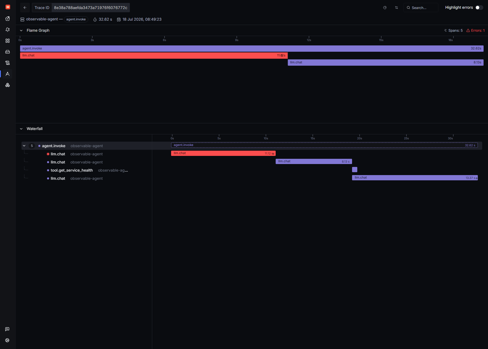
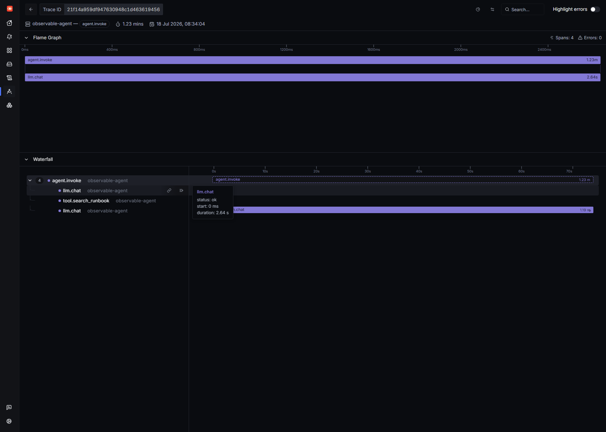
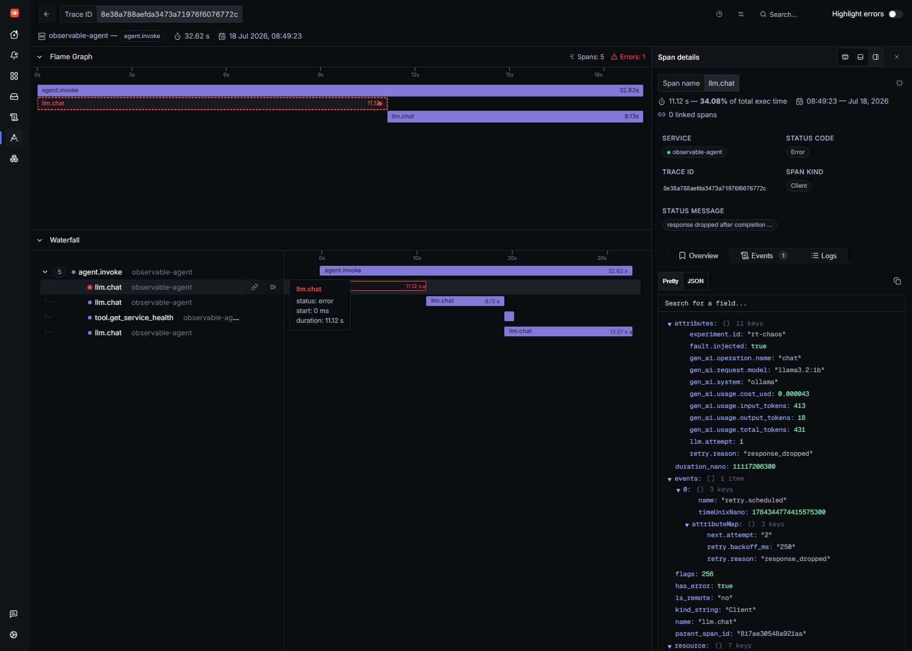
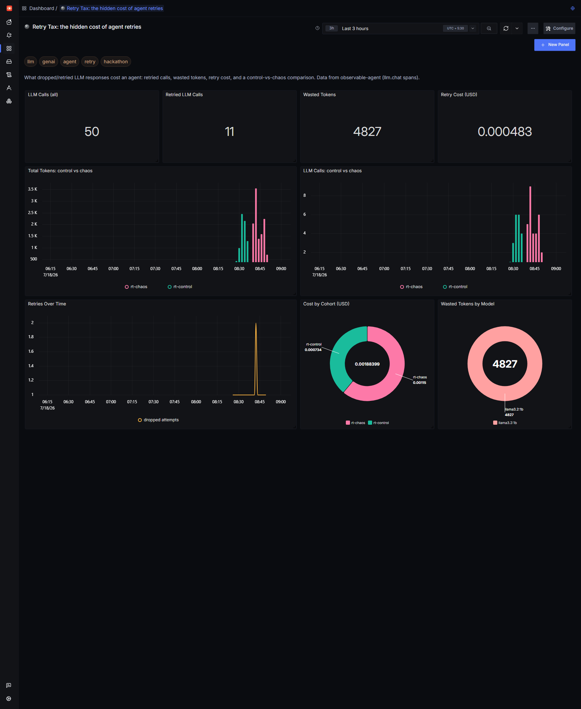
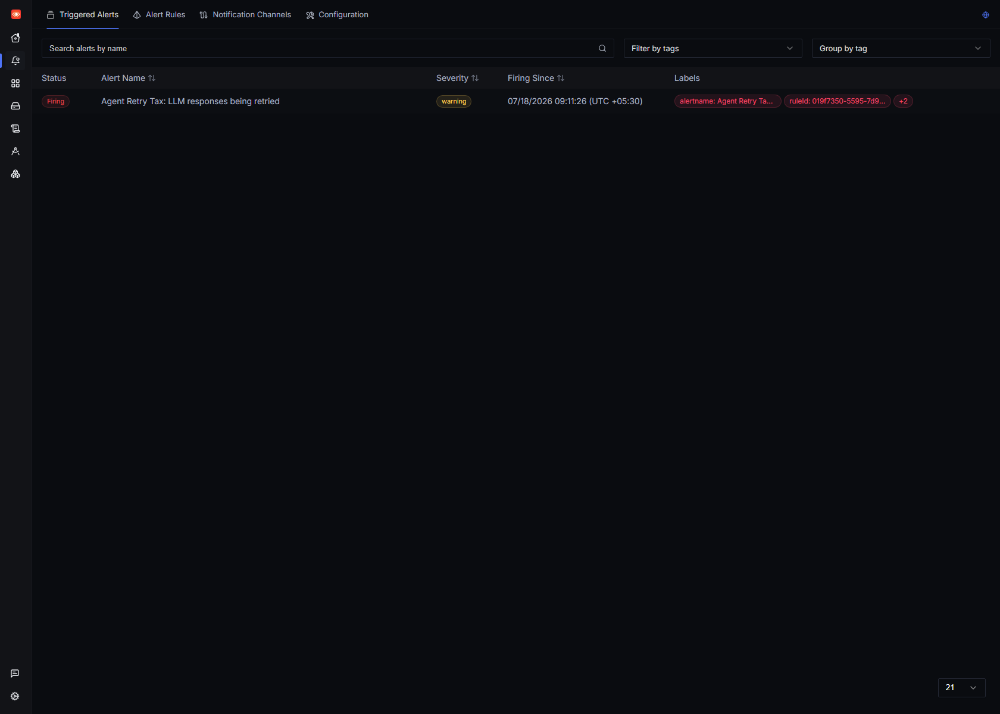

# The Retry Tax

Every "AI agent" retries. The model returns malformed JSON, a guardrail rejects the answer, a tool-call schema doesn't validate, a request times out — so the agent quietly runs the model again. That retry is usually invisible. It doesn't throw. The user still gets an answer. But you paid for the inference **twice**: twice the tokens, twice the latency, twice the GPU-seconds. I call it the **retry tax**, and until you trace it, it's a silent line item on your bill.

In an [earlier post](BLOG_EYES) I gave a small local-Llama SRE agent OpenTelemetry eyes and found one LLM call was 84.5% of a request. This post is the follow-up I actually care about: I made that agent **retry once**, deliberately, and measured the tax in **self-hosted SigNoz**. One wasted call — a response the agent generated and then threw away — turned out to be **34% of the request's wall-clock time**. I only know that because the trace shows the work that got discarded.

Everything here is local and free: **SigNoz v0.133**, **Ollama** running `llama3.2:1b` on CPU, and ~200 lines of instrumented Python. No cloud model, no vendor dashboard.

---

## The failure I wanted to see

Real retries have messy causes. To study the *cost* of a retry without the noise of *why*, I injected a clean, deterministic fault: **drop the first completed response exactly once per request.** The key word is *completed* — the model already ran, the tokens were already spent. Then the agent has to infer again. That's the honest shape of a retry: you don't get the tokens back.

The whole fault is four environment-driven knobs in `config.py`:

```python
# EXPERIMENT_ID tags every span + metric so "control" and "chaos" cohorts are
# directly comparable in SigNoz. CHAOS_DROP_RESPONSE_ONCE drops the first
# completed response of each request, forcing exactly one retry.
EXPERIMENT_ID   = os.getenv("EXPERIMENT_ID", "")
CHAOS_DROP_ONCE = os.getenv("CHAOS_DROP_RESPONSE_ONCE", "0") == "1"
LLM_MAX_ATTEMPTS = int(os.getenv("LLM_MAX_ATTEMPTS", "1"))
RETRY_BACKOFF_MS = int(os.getenv("RETRY_BACKOFF_MS", "250"))
```

The agent's LLM round-trip becomes an attempt loop. Each attempt is its own `llm.chat` span, so a retry literally *duplicates* the span inside the same trace — the retry tax made visible:

```python
def _chat(self, messages):
    max_attempts = max(config.LLM_MAX_ATTEMPTS, 2 if config.CHAOS_DROP_ONCE else 1)
    for attempt in range(1, max_attempts + 1):
        with tracer.start_as_current_span("llm.chat", kind=SpanKind.CLIENT) as span:
            span.set_attribute("llm.attempt", attempt)
            resp = self.client.chat.completions.create(...)   # inference runs here
            in_tok  = resp.usage.prompt_tokens
            out_tok = resp.usage.completion_tokens

            # Injected fault: drop this completed response exactly once. The
            # tokens above were really generated, so we still record them
            # (status="dropped") -- that is the wasted work of the retry.
            if attempt < max_attempts and getattr(self._chaos, "armed", False):
                self._chaos.armed = False
                telemetry.record_llm(config.MODEL, in_tok, out_tok, latency_ms, "dropped")
                telemetry.record_retry(config.MODEL, "response_dropped")
                span.set_attribute("fault.injected", True)
                span.set_attribute("retry.reason", "response_dropped")
                span.add_event("retry.scheduled",
                               {"retry.reason": "response_dropped",
                                "retry.backoff_ms": backoff_ms,
                                "next.attempt": attempt + 1})
                span.set_status(Status(StatusCode.ERROR, "response dropped after completion"))
                time.sleep(backoff_ms / 1000.0)
                continue
            ...
            return choice.message
```

Two details make this trace *useful* instead of just red:

1. The dropped attempt still **records its tokens** (`status="dropped"`). Wasted work you don't measure isn't waste — it's a mystery.
2. `experiment.id` is stamped on every span and every metric, so a `control` run and a `chaos` run are directly comparable in the Query Builder. One counter counts the retries themselves:

```python
def record_retry(model, reason):
    """Count one retry (e.g. a dropped response forced the agent to re-infer)."""
    _retries.add(1, _tag({"gen_ai.request.model": model, "retry.reason": reason}))
```

---

## Two cohorts, same ten questions

I ran the identical load twice — ten SRE questions like *"Is checkout healthy?"* — and tagged them:

```bash
# control: no chaos
EXPERIMENT_ID=rt-control python run_load.py

# chaos: drop the first response of every request, once
EXPERIMENT_ID=rt-chaos CHAOS_DROP_RESPONSE_ONCE=1 python run_load.py
```

Then I asked ClickHouse (SigNoz's store) what the tax was:

| Metric (10 requests each) | `rt-control` | `rt-chaos` | Δ |
|---|---|---|---|
| `llm.chat` spans | 20 | 30 | **+50%** |
| Dropped (wasted) calls | 0 | 10 | +10 |
| Total tokens | 7,322 | 11,515 | **+57%** |
| — of which *wasted* | 0 | **4,393** | 38% of all tokens |
| Cost (USD) | $0.000734 | $0.001153 | **+57%** |
| Avg latency / request | 43.1 s | 57.0 s | **+32%** |
| p95 latency | 91.2 s | 106.1 s | +16% |

One retry per request — the mildest possible retry policy — cost **57% more tokens and money** and made the agent **a third slower**. **38% of every token the chaos cohort burned went to answers it threw in the bin.** Now imagine a real policy of "retry up to 3× on invalid JSON" against a paid API.

---

## Reading the tax in a single trace

Here's one `chaos` request. The waterfall tells the whole story at a glance — **5 spans, 1 error**:



Top to bottom: `agent.invoke` → a **red `llm.chat`** (the dropped attempt) → a second `llm.chat` (the retry) → `tool.get_service_health` → a final `llm.chat`. Two back-to-back inference spans *before any useful work happens*. In the clean cohort that first red span simply doesn't exist:



Click the red span and the attributes make the waste concrete — and queryable:



That single dropped call was **11.12s — 34.08% of total execution time**, spent **431 tokens** (413 in + 18 out), and carries a `retry.scheduled` **span event** with `retry.backoff_ms: 250` and `next.attempt: 2`. Because these are real span attributes, "show me every dropped inference and how many tokens it wasted" is just a filter: `name = 'llm.chat' AND retry.reason = 'response_dropped'`.

---

## A dashboard for the tax

Same filter, turned into a **Retry Tax dashboard** via the SigNoz dashboards API (v5 query-builder schema, `dataSource: traces`). The `experiment.id` tag does the control-vs-chaos split for free:



The clearest panel is **Cost by Cohort**: the pink `rt-chaos` slice ($0.00115) is over 1.5× the green `rt-control` slice ($0.00073) for *the exact same ten questions*. The value tiles count retried calls and wasted tokens straight from the span attributes — no code change, just a query. (They read a little above the clean table further up because the dashboard tallies every request in its window, warm-ups included; the table is the controlled 10-vs-10.)

---

## Closing the loop: alert on the tax

A number on a dashboard nobody looks at is worthless. So I made the retry tax **page me**. SigNoz v0.133 alert rules use the new v5 `queries: []` array (each query wrapped in a `{type, spec}` envelope) — worth knowing, because the old `builderQueries` map returns a flat *"alert rule is not valid"*. The rule counts dropped attempts over a window:

```json
{
  "alert": "Agent Retry Tax: LLM responses being retried",
  "alertType": "TRACES_BASED_ALERT",
  "version": "v5",
  "condition": {
    "compositeQuery": {
      "queries": [{
        "type": "builder_query",
        "spec": {
          "name": "A", "signal": "traces",
          "aggregations": [{ "expression": "count()" }],
          "filter": { "expression":
            "service.name = 'observable-agent' AND name = 'llm.chat' AND retry.reason = 'response_dropped'" }
        }
      }],
      "panelType": "graph", "queryType": "builder"
    },
    "op": "above", "target": 0, "matchType": "at_least_once"
  }
}
```

`POST /api/v1/rules`, and within a minute it was firing on the chaos data:



Now the moment my agent starts silently re-inferring — dropped responses, guardrail rejects, 429 back-offs — I find out from an alert instead of from a surprise invoice.

---

## What's honest about this

I *injected* the fault, so don't read the exact 57% as a universal constant — your tax depends on your retry policy and how often reality trips it. But the **mechanism** is completely real: an LLM call that completes and then gets discarded costs you full tokens and full latency, and by default that cost is invisible because the agent recovers. Genuine sources of the same tax: JSON that won't parse, tool arguments that fail schema validation, content-filter rejections, timeouts, and rate-limit retries — each re-invokes the model, producing the same duplicated `llm.chat` span you see here. (This demo wires up the dropped-response path; the others share the identical signature.)

The takeaway isn't "retries are bad" — retries are how agents stay reliable. It's that **an un-observed retry is a tax you can't see, can't bound, and can't alert on.** Three OpenTelemetry attributes — `llm.attempt`, `retry.reason`, and the dropped-attempt's token counts — turn it into a first-class signal you can trace, chart, and page on. In SigNoz, that took one attribute loop and one filter.

If you can't observe your AI agents, you don't own them — and you definitely don't own their retry bill.

*Stack: SigNoz v0.133 (self-hosted via Foundry on WSL2 + Docker Engine), OpenTelemetry Python SDK, Ollama `llama3.2:1b`. Agent + instrumentation + load driver: ~250 lines of Python. Built for the WeMakeDevs × SigNoz "Agents of SigNoz" hackathon.*
