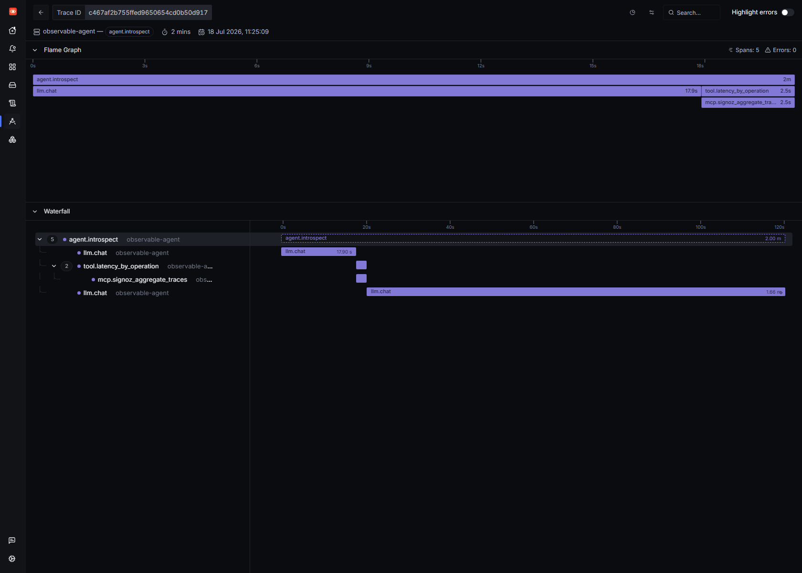
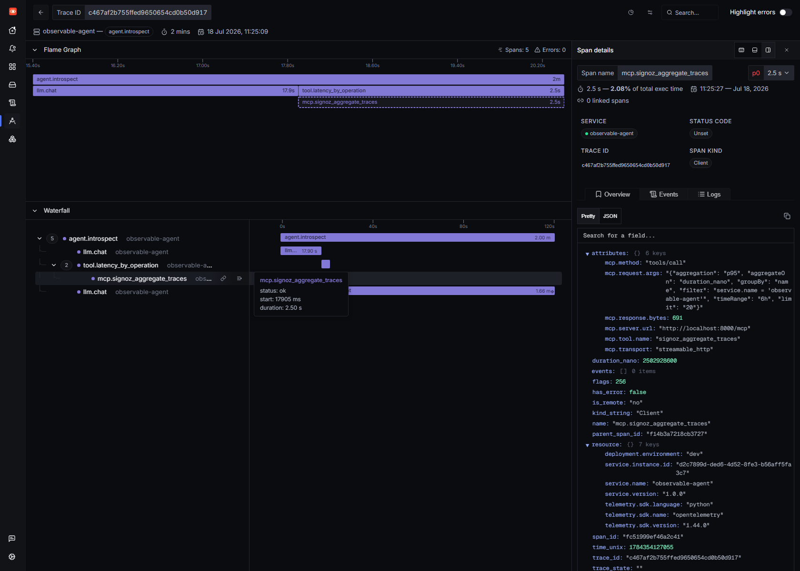
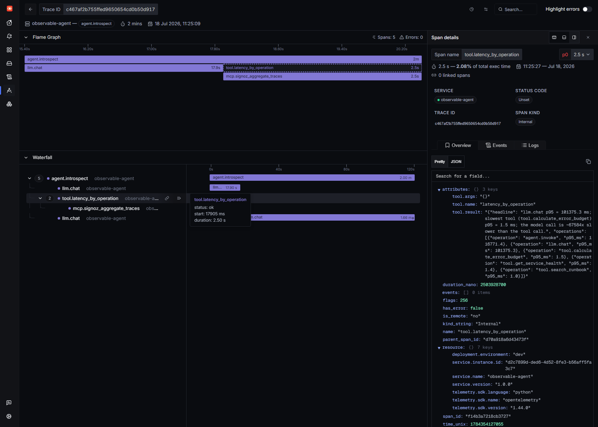

# The agent that reads its own traces

Observability is something we do *to* our agents. We instrument them, then a human opens SigNoz and reads the waterfall. But SigNoz now ships an **MCP server**, a [Model Context Protocol](https://modelcontextprotocol.io/) interface that turns "search traces", "aggregate latency", "list services" into tools an LLM can call. So the console isn't human only anymore. Which raises a fun question:

> What if the agent read its **own** traces and debugged **itself**?

So I connected my agent, a tiny `qwen2.5:3b` running on **CPU** via Ollama, no GPU, no cloud, to the SigNoz MCP server and asked it one question: **"Why are you slow?"** It called an MCP tool, pulled its own p95 latency out of SigNoz, and answered:

> *"The llm.chat model calls have a p95 latency of approximately **101,375.3 ms**, while the tool.* calls have a p95 of about **1.5 ms**. The model call is roughly **67,584 times slower** than the tool call... focus on optimizing the llm.chat model calls or consider a more efficient alternative."*

That is the agent rediscovering, from the *inside*, the exact lesson I found by hand in [my first post](BLOG_EYES) (one LLM call was 84.5% of a request). Only this time I didn't read the trace. It did.

Everything is local and free: **SigNoz v0.133**, the **SigNoz MCP server**, and **Ollama** on CPU. Here's how it works, and the two things that actually made a tiny model reliable over MCP.

---

## The loop: an agent that observes the observer

The agent already emitted OpenTelemetry traces (`agent.invoke → llm.chat → tool.*`). To let it read them back, I gave it a second entrypoint with a different toolset: instead of the fake SRE tools, it gets **SigNoz MCP tools**, and the whole session is rooted in an `agent.introspect` span. That means the self debugging run is *itself* a trace you can open in SigNoz, the observer, observed:



Top to bottom: `agent.introspect` → `llm.chat` (the model decides what to look at) → `tool.latency_by_operation` → **`mcp.signoz_aggregate_traces`** (a real MCP call out to the server) → `llm.chat` (the diagnosis). The agent made an MCP request to SigNoz *as a step inside its own trace*.

The MCP server itself is one binary in HTTP mode:

```bash
SIGNOZ_URL=http://localhost:8080 SIGNOZ_API_KEY=$KEY \
  TRANSPORT_MODE=http MCP_SERVER_PORT=8000 ./signoz-mcp-server
# -> listening on :8000/mcp, 41 tools registered
```

And the client bridge is deliberately tiny. The agent loop is synchronous, so each tool call opens a short lived streamable HTTP session:

```python
from mcp import ClientSession
from mcp.client.streamable_http import streamablehttp_client

class SigNozMCP:
    def call_tool(self, name, args):
        async def run():
            async with streamablehttp_client(self.url) as (r, w, _):
                async with ClientSession(r, w) as s:
                    await s.initialize()
                    return await s.call_tool(name, args or {})
        result = asyncio.run(run())
        return "\n".join(c.text for c in result.content if c.type == "text")
```

Every tool the model calls is wrapped in its own `mcp.*` span, so the MCP round trip shows up in the trace with the exact request it made:

```python
def _mcp_call(mcp, tool_name, args):
    with tracer.start_as_current_span(f"mcp.{tool_name}", kind=SpanKind.CLIENT) as span:
        span.set_attribute("mcp.tool.name", tool_name)
        span.set_attribute("mcp.method", "tools/call")
        span.set_attribute("mcp.transport", "streamable_http")
        span.set_attribute("mcp.request.args", json.dumps(args))
        return json.loads(mcp.call_tool(tool_name, args))
```

Click that span and there's the proof it was a genuine MCP protocol call, and that the agent was querying **itself**:



`mcp.tool.name: signoz_aggregate_traces`, `mcp.method: tools/call`, and the args: *aggregate p95 of `duration_nano`, grouped by span name, filtered to `service.name = 'observable-agent'`.* The agent asked SigNoz for its own latency profile.

---

## Honest problem #1: a 3B model can't drive 41 raw MCP tools

Here's the part the demos skip. The SigNoz MCP server exposes **41 tools**, and the good ones take rich arguments: nanosecond durations, free form SigNoz filter expressions, `groupBy` keys, relative time ranges. That's fine for Claude. It is *not* fine for a 3B model on CPU. My first attempt handed the model the raw tools. `llama3.2:3b` didn't even emit a valid tool call. It printed one as text:

```
A: {"name":"latency_by_operation","parameters:{}}   # <- malformed, not a real tool call
```

Two fixes made it reliable:

1. **A tool calling model.** `llama3.2:3b` fumbles the function calling format; `qwen2.5:3b` (same size, same CPU) gets it right. Model choice matters more than model size here.
2. **Curated, argument free tools.** Instead of exposing 41 tools with complex schemas, I expose **three** with no arguments: `list_my_services`, `latency_by_operation`, `find_slowest_traces`, each of which pins the correct arguments and calls a real MCP tool under the hood. The model picks *what to look at*; the wrapper handles *how to ask*.

```python
def latency_by_operation(**_):
    """MCP: signoz_aggregate_traces -> p95 latency per operation."""
    parsed = _mcp_call(mcp, "signoz_aggregate_traces", {
        "aggregation": "p95", "aggregateOn": "duration_nano",
        "groupBy": "name", "filter": f"service.name = '{SERVICE}'",
        "timeRange": "6h",
    })
    # ...trim the big JSON down to [{operation, p95_ms}] the model can reason about
```

This is the pattern for small models + MCP: **don't expose the raw firehose; expose a few intention shaped tools and let the server do the heavy lifting.**

---

## Honest problem #2: small models hallucinate numbers, so let SigNoz do the math

Even with a clean tool result, `qwen2.5:3b`'s first diagnosis invented figures out of thin air: "llm.chat p95 is 200ms, tools are 300ms." Those numbers appear *nowhere* in the data. A 3B model is a bad calculator and a worse transcriber of long decimals.

The fix isn't a bigger model. It's **the right division of labour**. Percentile math is exactly what SigNoz's aggregation is *for*, so I compute the comparison in the tool and hand the model a factual, hard to hallucinate headline. The model's job is to orchestrate and interpret, not to do nanosecond arithmetic in its head:

```python
headline = (f"llm.chat p95 = {llm_ms} ms; slowest tool ({tool_name}) "
            f"p95 = {tool_ms} ms; the model call is ~{ratio}x slower than the tool call.")
return {"headline": headline, "operations": ops}
```

With that grounding, the diagnosis became correct and specific. You can see the exact numbers it read, captured in the tool span's result attribute:



`llm.chat` p95 **101,375.3 ms** vs the slowest real tool at **1.5 ms**. The agent read that and concluded, correctly, that it is ~67,000× bottlenecked on the model, not its logic, not its tools.

---

## The observer effect is real (and it's in the trace)

One honest wrinkle: the introspection runs are themselves slow (CPU inference), so they **pollute the very data the agent reads**. The first version of my latency tool proudly reported that `agent.introspect` was the slowest operation because it was measuring itself. The `mcp.*` and telemetry reading `tool.*` spans, dominated by the SigNoz round trip, leaked into the "tool" numbers too and shrank the ratio from ~67,000× to a meaningless 12×.

The fix was to exclude the introspection scaffolding (`agent.introspect`, `mcp.*`, the three reader tools) from the comparison so the agent reasons about its real request serving workload. But it's a genuine lesson worth stating plainly: **when an agent observes itself, it perturbs what it observes.** You can see it happen span by span.

---

## Why this is a different corner of MCP

SigNoz's own MCP examples, reasonably, show a frontier cloud model (Claude, Cursor) querying a production stack. This is the opposite extreme on purpose:

| | Typical MCP demo | This |
|---|---|---|
| Model | Cloud frontier (Claude/GPT) | `qwen2.5:3b`, **CPU only, local** |
| Target | Someone else's production | Its **own** traces |
| Network | SaaS | Fully **offline** |
| Point | Human asks about a service | Agent **debugs itself** |

None of it is cloud shaped. A 3 billion parameter model on a laptop CPU used a standards based protocol to read its own OpenTelemetry data out of a self hosted backend and reached a true conclusion about its own performance. That is a self observing agent, built from open parts.

## What's honest about this

The model doesn't do the percentile math and I curated its tools. That's not cheating, it's system design: the LLM orchestrates and interprets, SigNoz computes, MCP is the contract between them. What's completely real is the loop: the agent *chose* to look at latency, issued a real `tools/call` to the SigNoz MCP server, read numbers measured from its own spans, and diagnosed itself. And it did it on hardware you already own.

The takeaway from my [first](BLOG_EYES) and [second](BLOG_RETRYTAX) posts was "you can't own an agent you can't observe." MCP adds a sequel: once the telemetry is an agent callable API, the agent can observe *itself*. The next step, closing the loop from *diagnose* to *act*, is suddenly a very short walk.

*Stack: SigNoz v0.133 (self hosted, WSL2 + Docker Engine), SigNoz MCP server (HTTP/streamable transport, 41 tools), OpenTelemetry Python SDK, Ollama `qwen2.5:3b` on CPU. Introspection agent + MCP bridge + curated tools: ~200 lines of Python. Built for the WeMakeDevs × SigNoz "Agents of SigNoz" hackathon.*
