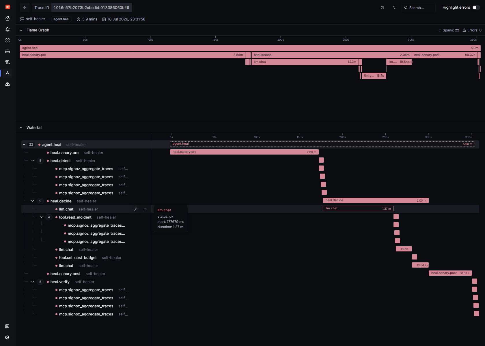
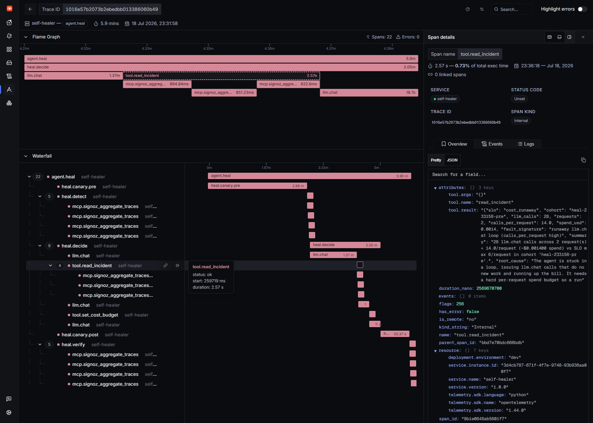
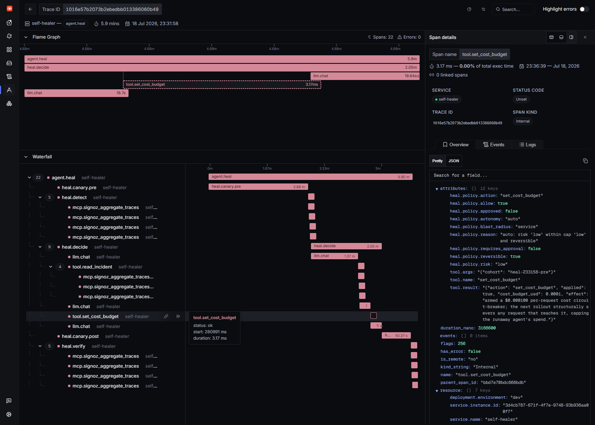
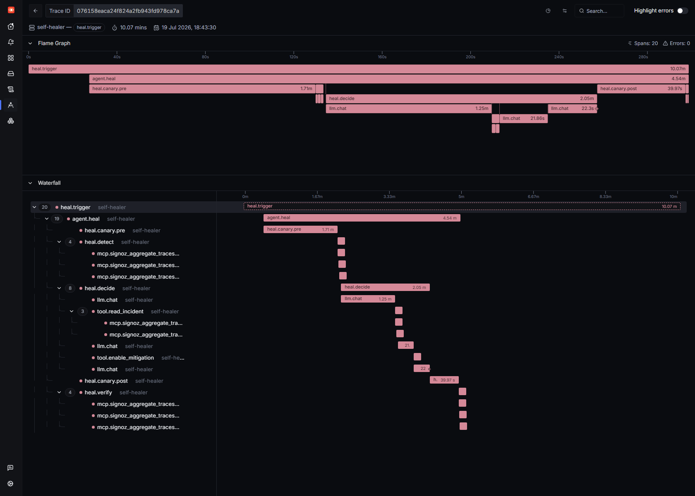

# Self Healing SRE Sidekick

*Track T01: AI & Agent Observability · Agents of SigNoz (WeMakeDevs × SigNoz)*

**A local AI agent that uses self hosted SigNoz, through its MCP server, as the
sensor in a *governed* closed control loop: it detects a reliability SLO breach,
diagnoses it, applies a **policy gated** remediation, verifies the fix, and rolls
it back if the breach doesn't clear. Everything runs on a laptop: SigNoz in
WSL2, the model on Ollama. No cloud, no API keys, no bill.**

> Most "AI + observability" demos stop at *observe*. This one closes the loop to
> *act*, and then uses the same observability backend to **prove** the fix
> worked. SigNoz isn't the dashboard you look at afterwards; it's the alert that
> wakes the agent and the sensor it is wired into.

---

## The hero run

One command, `python self_heal.py`, produced this trace on the `self-healer`
service. **The entire self healing cycle is a single distributed trace:**


```
agent.heal                              2.93 min   (service = self-healer)
├─ heal.canary.pre        32.9s   BREAK IT   : roll out the workload under the fault
├─ heal.detect             2.2s   DETECT     : 3× mcp.signoz_aggregate_traces
├─ heal.decide            51.7s   DIAGNOSE + DECIDE (local qwen2.5:3b)
│  ├─ llm.chat            26.5s
│  ├─ tool.read_incident  1.6s   → 2× mcp.signoz_aggregate_traces   (evidence via MCP)
│  ├─ llm.chat            13.4s
│  ├─ tool.disable_fault_injection  2ms   ← the remediation (model chosen)
│  └─ llm.chat            10.1s
├─ heal.canary.post       86.0s   VERIFY     : roll out again under the fixed config
└─ heal.verify             2.3s   → 3× mcp.signoz_aggregate_traces
```

| Metric | Value |
|---|---|
| Retry tax SLO | 5% max dropped and retried `llm.chat` |
| Retry rate **before** | **40%** (breach) |
| Retry rate **after** | **0%** (healed) |
| Remediation | `disable_fault_injection`: **chosen by the model**, not scripted |
| MTTR | **141s** (breach detected → verified healed) |
| Trace ID | `31514172b44f0f64548eec5c897eb35b` |

### It diagnosed the incident *by querying SigNoz*

The model's first tool call, `read_incident`, is backed by two live
`signoz_aggregate_traces` calls over the MCP server. The structured evidence it
got back, retry rate `0.333`, `dropped_and_retried: 2`, and the root cause,
came straight out of the traces the workload had just emitted:


> The detector fired at **40%** (2 of 5 calls). A beat later, when the model read
> the incident, a sixth call had landed, so `read_incident` shows 2/6 = **33%**.
> Same two dropped calls, same breach: a live look at the ingestion lag the sensor
> is built to tolerate (it waits for the cohort before it judges).

### Then it acted

Given that evidence, `qwen2.5:3b` chose `disable_fault_injection` on its own and
called it. The span records the effect of the control plane change:


> `tool.result = {"action": "disable_fault_injection", "applied": true,
> "effect": "removed the injected response drop at its source; the next rollout
> will not retry."}`

### And the loop is its own scoreboard

The Self Healing dashboard reads the *same* traces back as before/after
evidence: heal cycles, breaches remediated, the retried calls that vanish
between the `-pre` and `-post` cohorts, and the `agent.heal` span breakdown:


---

## A second incident: the bill shock kill switch

The retry tax wastes tokens a few at a time. The scarier failure is a **runaway
agent**, one stuck in a loop, issuing LLM call after LLM call, running up an
unbounded bill. Same governed loop, a different sensor and a different fix:

```bash
python self_heal.py --scenario cost
```

The workload is seeded with a runaway loop fault (honest chaos, like the
response drop) so each request keeps issuing "reflection" `llm.chat` calls that do
no new work. The cost sensor measures **calls per request** from the traces; the
SLO is a ceiling of 6.



In the hero run (trace `1016e57b2073b2ebedbb013386060b49`), the local
`qwen2.5:3b` read the incident via MCP: *"28 `llm.chat` calls across 2 requests =
14/request, ~$0.0014 spend, vs SLO max 6"*, and chose **`set_cost_budget`** on
its own. That arms a per request **cost circuit breaker**: the next rollout
structurally **severs** any request that reaches the budget, so a runaway can't
keep spending.



> `tool.result` came straight from the traces the runaway had just emitted:
> `llm_calls: 28`, `calls_per_request: 14.0`, `spend_usd: 0.0014`, and a root
> cause: *"stuck in a loop … it needs a hard per request spend budget."*

| Metric | Value |
|---|---|
| Cost SLO | ≤ 6 `llm.chat` calls per request |
| Calls/request **before** | **13.5** (breach) |
| Calls/request **after** | **2.5** (healed) |
| Spend/request | **$0.000700 → $0.000123** (~82% cut) |
| Remediation | `set_cost_budget`: **chosen by the model**; arms a $0.0001/request breaker |
| MTTR | **177s** (breach detected → verified healed) |
| Trace ID | `1016e57b2073b2ebedbb013386060b49` |



> The span carries the whole decision: `heal.policy.risk = low`,
> `heal.policy.reversible = true`, `heal.policy.autonomy = auto` →
> `heal.policy.allow = true` (*"risk 'low' within cap 'low' and reversible"*), and
> the effect: *"armed a $0.000100 per request cost circuit breaker; the next
> rollout structurally severs any request that reaches it."*

The kill switch is a real structural cut, not a warning: when cumulative
per request cost crosses the budget, the agent stops issuing LLM calls, tags the
span `agent.request.severed = true` / `cost.circuit_broken = true`, and emits an
`agent.cost.circuit_break` metric. Verification queries SigNoz again and sees
calls per request back under the SLO, healed, grounded in telemetry.

---

## SigNoz closes the loop: its alert is the trigger

The two runs above start with a command. The real version does not wait for a
human to type anything. A SigNoz **alert** is the trigger, and that same alert
resolving is the close.

`heal_bridge.py` is a small long lived service that watches SigNoz. The moment the
retry tax alert moves to *firing*, the bridge opens a `heal.trigger` span, injects
its trace context into the heal it launches, and then waits for SigNoz to move that
same alert back to *resolved*.

```bash
python heal_bridge.py             # watch SigNoz; heal when the alert fires
python self_heal.py --break-only  # (in another shell) arm a breaching rollout so it fires
```

In a live end to end run the alert fired on its own, the bridge caught the
`inactive → firing` transition, launched the governed heal, and this time the model
chose `enable_mitigation`, a different but equally valid fix from the retry hero's
`disable_fault_injection`. That the model picks different valid remedies on
different runs is the point: the choice is real, driven by the evidence, not
scripted. Retry rate **40% → 0%**, heal **MTTR 166s**, and then SigNoz flipped the
alert back to resolved and the bridge recorded the loop closed.

Because the bridge injects its trace context into the heal, the alert handoff and
the entire heal are **one distributed trace**
(`076158eaca24f824a2fb943fd978ca7a`):

```
heal.trigger                     ← SigNoz alert fires (heal_bridge.py)
└─ agent.heal
   ├─ heal.canary.pre            BREAK confirmed
   ├─ heal.detect                DETECT : signoz_aggregate_traces (MCP)
   ├─ heal.decide                DECIDE : llm.chat + read_incident + enable_mitigation
   ├─ heal.canary.post           VERIFY : roll out under the fix
   └─ heal.verify                → retry rate 0, healed
```



You can open the alert in SigNoz and walk straight down into the heal it caused.
That is what makes SigNoz more than a dashboard here: its alerting is the
**trigger** and its query surface is the **verdict**. The monitoring system opens
the incident and closes it; the agent only decides what to do in between.

> The direct `python self_heal.py` runs stay in the repo because they are faster to
> demo and reproduce. The alert triggered path is the same heal, with SigNoz holding
> the trigger instead of a human.

---

## Governance: every action passes a policy gate

Letting software *act* on production is only safe if the action is constrained.
So every actuator mutation routes through a **policy gate** (`heal_policy.py`)
*before* it can touch the control plane:

- **Autonomy levels**: `observe → suggest → approve → auto`. The gate reads
  `HEAL_AUTONOMY`; in `auto` it applies changes itself, in `approve` it holds them
  for a human, in `suggest`/`observe` it only proposes.
- **Per action risk + reversibility + blast radius**: every action carries a
  static policy. In `auto` with `auto_max_risk = low`, low risk *reversible*
  actions (`disable_fault_injection`, `enable_mitigation`, `set_cost_budget`)
  apply automatically; a medium risk `switch_model` is **held for approval** instead of
  being forced through.
- **An audit line per decision**: allowed / held / denied, with the reason,
  recorded as a `heal.policy` metric and printed, a trail of *what was allowed
  and why*.

When an action is held, the orchestrator doesn't force it, it **escalates**
(*"remediation held for human approval"*) and stops. And when an applied action
*doesn't* clear the breach, the loop **rolls back**: it snapshots the control
plane before each attempt and, on a failed verify, restores the snapshot (a
`heal.rollback` span) before trying the next action. The retry hero heals on the
first attempt, so it never needs the rollback, but the machinery is there, and
it's what separates "act" from "act *safely*".

---

## Built to be trusted: fast, decisive, and offline by default

An SRE agent that watches production has to be more than a clever demo. Three
questions decide whether you would actually let it run, and the loop has a
concrete answer to each.

**Do you even need an LLM to read a metric?** No, and it never does. Detection and
verification are deterministic. `heal_sensors.py` reads one of three states, PASS,
BREACH, or UNKNOWN, and the safety property is that a blind sensor (a failed MCP
query) reports UNKNOWN and the loop refuses to act, it never silently reports a
healthy zero. On top of the fixed SLO floor, `heal_stats.py` adds distribution
free anomaly detection over the service's own SigNoz derived history: a median and
MAD modified z score, an EWMA baseline, and a CUSUM change detector for a small but
persistent drift a single point test would miss. That is pure stdlib math,
deterministic, and instant. You do not need a neural network to know a metric is
out of character, you need robust statistics, and a sub floor anomaly is escalated
to a human rather than auto healed. The model is asked exactly one thing: given a
confirmed breach, what should we do. Everything on the reliability hot path is
model free and fast.

**Does it get faster and more decisive over time?** Yes, it learns. The first time
an incident class appears, the local model reads the SigNoz evidence and chooses a
fix. Only after SigNoz *verifies* the fix worked is that (fingerprint to action)
pair written to `heal_memory.py` as a proven record. The next time the same class
appears, the healer recalls the known good fix and replays it with no model call at
all, still through the policy gate, still verified against SigNoz afterward. The
incident identity is a deterministic fingerprint (`heal_fingerprint.py`), a pure
function of the breach evidence, so recall never drifts. In the run captured for
this writeup the retry tax was recalled from memory (proven twice) and healed in
41s with the decision source recorded as `memory`, not `llm`. This is a
deterministic lookup and replay of proven fixes, not an exploring bandit: only
verified heals are ever stored, and recall is gated on severity.

**Why local, when every model is in the cloud?** Because an always on agent that
reads production telemetry is exactly where local inference earns its keep: no API
keys, no data egress, and zero marginal cost per heal. The default is `qwen2.5:3b`
on Ollama and the whole loop runs offline. The agent is provider neutral though, it
speaks to any OpenAI compatible endpoint, so tiered routing (`config.py`) can
escalate the single hard decision to a stronger hosted model when you want it,
while detection, verification, memory recall, and every other step stay local.
Privacy and cost and availability by default, cloud reach when a decision is worth
it.

And none of this rests on two happy path runs. `eval.py` is a chaos harness that
drives the real hardened decision core across a randomized suite of adversarial
episodes: a healthy service that must not be touched, a blind sensor the healer
must refuse to act on, a remediation that fails to clear the breach (forcing a
verified rollback and a second attempt), an unfixable incident, a sub floor
statistical anomaly that must stay human in the loop, and a recurrence that must be
recalled from memory with no model call. The suite asserts **zero unsafe actions**.
Combined with the policy gate, the rollback, and a **backstop SigNoz alert** that
fires if a heal ever fails to resolve, failure is contained and observable, never
silent.

---

## Why this is a good use of SigNoz

SigNoz plays **four roles** in one loop, and because they all read the same telemetry, they share one source of truth:

1. **Trigger**: a SigNoz **alert** firing is what wakes the healer in the first
   place (`heal_bridge.py`), and that same alert moving back to resolved is what
   closes the incident. SigNoz opens and closes the loop.
2. **Sensor**: `heal.detect` asks SigNoz *"did this rollout breach the
   retry tax SLO?"* via `signoz_aggregate_traces`. Deterministic. No LLM.
3. **Diagnostic surface**: the model's `read_incident` tool drills the same
   traces through the **SigNoz MCP server** to build the incident evidence the
   model reasons over.
4. **Scoreboard**: `heal.verify` queries SigNoz again after the fix. Retry rate
   back to zero = healed, and that's what sets MTTR. The verdict is grounded in
   telemetry, not in the model's say so.

Detection and verification are **deterministic MCP queries**, the LLM is *only*
asked to decide what to do about a confirmed breach. That keeps the model out of
the reliability hot path while still making the interesting decision agentic.

---

## Architecture

Two services show up in SigNoz, exactly as they would in production:

- **`observable-agent`**: the managed workload (the SRE sidekick agent from the
  blog series). It's the thing that gets sick.
- **`self-healer`**: the control loop that watches it, decides, and acts.

```
                    ┌──────────────────────────────────────────┐
                    │  self-healer  (agent.heal trace)          │
                    │                                           │
   heal_state.json  │   detect ─► decide (qwen2.5:3b) ─► act    │
   (control plane)  │     │            │                  │     │
        ▲           │     ▼            ▼                  ▼      │
        │           │   SigNoz     read_incident     actuator   │
        │  writes   │   (MCP)        (MCP)          (mutates ────┼──┐
        └───────────┼─────────────────────────────── control    │  │
                    │     ▲                            plane)     │  │
                    │     │ verify (MCP)                          │  │
                    └─────┼─────────────────────────────────────-┘  │
                          │                                          │
                          │   OTLP traces + metrics                  │ next rollout
                          │                                          │ reads config
                    ┌─────┴──────────────┐                          │
                    │      SigNoz         │◄── OTLP ── observable-agent ◄┘
                    │  (traces/metrics)   │           (canary subprocess)
                    └─────────────────────┘
```

**The canary is a real subprocess rollout.** Each `heal.canary.*` phase launches
`heal_canary.py` as a child process with a fresh environment derived from the
control plane. So when an actuator flips a config value, the next rollout picks
it up on process start, a genuine config and roll, not an in process
monkey patch. Cohorts are tagged `experiment.id = heal-<cycle>-{pre,post}` so
rollouts never bleed into each other's SLO math.

### Modules

| File | Role |
|---|---|
| `self_heal.py` | Orchestrator + the `agent.heal` root trace. Governed `detect → decide → act → verify → rollback`, MTTR, outcome. `--scenario {retry,cost}`; `--break-only` arms a breaching rollout and `--no-seed`/`--triggered-by` let a SigNoz alert drive it. |
| `heal_bridge.py` | The **trigger**: watches SigNoz alert state (plus an Alertmanager webhook), launches the governed heal in the alert's own trace when it fires, then waits for SigNoz to mark the alert resolved. |
| `heal_alert.py` | Creates or updates the SigNoz alert rule that fires the heal, with a demo tuned eval window, so the trigger is reproducible. |
| `heal_policy.py` | The **governor**: autonomy levels + per action risk/reversibility/blast radius; `evaluate()` is the gate every mutation passes before it touches the control plane. |
| `heal_sensors.py` | The **senses**: retry tax, latency, and cost (calls per request) SLO detectors, each a `signoz_aggregate_traces` call wrapped in an `mcp.*` span. **Three state** (PASS / BREACH / UNKNOWN, never a silent zero) and deterministic; a failed query refuses to heal. |
| `heal_stats.py` | **Robust statistics** supplement to the fixed SLO floor: median/MAD z score, EWMA baseline, and a CUSUM drift detector over the service's own history. Pure stdlib, deterministic, no neural net. A sub floor anomaly escalates to a human. |
| `heal_baseline.py` | Persisted ring buffer of the healer's own **healthy** SigNoz readings, the distribution `heal_stats` judges against. Breaching readings are never appended, so an incident cannot poison its own baseline. |
| `heal_memory.py` | **Verified remediation memory** (the learning loop): a (fingerprint to action) pair is stored only after SigNoz confirms the fix worked, then recalled and replayed on a recurrence with **no model call**. |
| `heal_fingerprint.py` | **Deterministic incident identity**: a pure function of the breach evidence (never the model's opinion), the stable key `heal_memory` recalls on. |
| `heal_actuators.py` | The **hands** (all **policy gated**): `read_incident` / `read_cost_incident` (MCP backed evidence) + `disable_fault_injection` / `enable_mitigation` / `set_cost_budget` (and a `switch_model` held for approval), exposed to the model as OpenAI tools. |
| `heal_controls.py` | The **control plane** (`heal_state.json`) shared by healer and canary; `snapshot()`/`restore()` back the rollback; `canary_env()` is the seam between them. |
| `heal_canary.py` | The **managed workload rollout**: runs the observable-agent under a cohort tag as a subprocess. |
| `heal_metrics.py` | Healer instruments: `heal.slo.breach`, `heal.action`, `heal.result`, `heal.mttr`, `heal.retry_rate`, `heal.policy`, `heal.rollback`, `heal.decision` (source: memory / llm / fallback), `heal.recall`, `heal.unsafe_action` (must stay 0), `heal.cost.*`, and the `heal.eval.*` suite. |
| `heal_dashboard.py` | Builds the Self Healing dashboard via the SigNoz v5 dashboards API. |
| `dashboard_fullsignal.py` | The **Track 02** dashboard: one Query Builder view of the loop across traces + metrics + logs; self verifies every panel, then exports importable JSON. See [`TRACK02.md`](TRACK02.md). |
| `config.py` | Provider neutral model config: local `qwen2.5:3b` by default (offline, no keys), with optional **tiered routing** that can escalate only the hard decision to a hosted OpenAI compatible model. |
| `eval.py` | **Chaos / eval harness**: drives the real hardened decision core across a randomized suite of adversarial episodes and asserts zero unsafe actions. |

---

## The incident: the retry tax

The breach the healer chases is the **retry tax** from the blog series: a fault
drops the *first completed* LLM response, so the agent infers again, spending the
tokens twice. It's a perfect self healing target because it's:

- **Real telemetry**, not a synthetic counter, a duplicate `llm.chat` span
  tagged `retry.reason = 'response_dropped'`.
- **Measurable as an SLO**: `dropped ÷ total` per rollout cohort.
- **Fixable two ways**, so the model has a genuine decision: remove the fault at
  its source (`disable_fault_injection`), or compensate with an idempotency
  guard (`enable_mitigation`). The control plane treats a mitigation as
  neutralising the drop even while the fault knob is armed.

---

## Run it yourself

Prereqs (see the repo [README](../README.md)): self hosted SigNoz on
`:8080`/`:4318`, the **SigNoz MCP server** on `:8000/mcp`, and Ollama with
`qwen2.5:3b` pulled.

```bash
# from the observable-agent/ directory, venv active
python self_heal.py                    # the retry tax incident
python self_heal.py --scenario cost    # the bill shock kill switch
```

It will: reset the workload to the broken state → roll out the `-pre` canary →
detect the breach via MCP → have the local model read the incident and pick a
**policy gated** fix → roll out the `-post` canary → verify via MCP (rolling back
if the breach didn't clear) → print the timeline, MTTR, and a link to the
`agent.heal` trace in SigNoz.

Then rebuild the dashboards any time with:

```bash
python heal_dashboard.py         # the Self Healing dashboard (traces)
python dashboard_fullsignal.py   # the Track 02 view: traces + metrics + logs
```

And prove the decision core is robust, not just lucky, with the chaos harness:

```bash
python eval.py --no-export       # randomized adversarial episodes; asserts 0 unsafe
python tests/run_all.py          # the unit suite
```

---

## Honest engineering lessons

The hackathon asks for real experience, so here's what actually bit:

- **Small models need a firm hand to tool call.** `llama3.2:3b` emitted a
  *malformed* tool call; `qwen2.5:3b` (same size) does reliable OpenAI format
  tool calling on Ollama. Even then, the healer prompt has to spell out
  *"`read_incident` only READS, you MUST follow it with a remediation"*, and the
  output token cap has to leave room (300) for the decision **and** the tool
  call, or the remediation call gets truncated. There's a wrapped safety net
  actuator for the rare miss, but in the hero run the model drove the whole
  thing.
- **Keep the LLM out of the reliability hot path.** Detection and verification
  are deterministic SigNoz queries. If the model hallucinates, the *decision*
  might be wrong, but the *breach* and the *healed* verdict are always grounded
  in telemetry. That's the difference between a demo and something you'd trust.
- **The observer effect is real.** The healer's own spans would pollute the
  workload's SLO math, so the two run as separate services and every SLO query
  is scoped to a single `experiment.id` cohort.
- **CPU inference is slow, and that's honest.** Each `llm.chat` is 10 to 110s on
  CPU; a full heal cycle is a few minutes. The latency tail is real, so there's
  genuinely something to observe, and MTTR means something.

---

## Why this fits Track T01

The brief taken literally: *close the loop from diagnose to act*:

- **Agent observability, end to end.** The whole remediation is one `agent.heal`
  trace on its own service; every decision, MCP call, and actuator is a span you
  can open.
- **SigNoz as the control surface, not just a dashboard.** The MCP server is the
  agent's sensor *and* scoreboard, detection and verification are real
  `signoz_aggregate_traces` queries, so the *healed* verdict is grounded in
  telemetry, not the model's word.
- **A measurable outcome, twice.** Retry tax SLO **40% → 0%** (MTTR 141s); and a
  runaway agent's spend **$0.000700 → $0.000123/request**, calls **13.5 → 2.5**
  (MTTR 177s), both on a live self hosted stack, each reproducible with one command.
- **It acts *safely*.** Every remediation clears a policy gate (autonomy level +
  risk + reversibility); risky actions are held for approval, and a fix that
  fails to verify is rolled back. Action without governance is a liability, this
  is action *with* it.
- **It learns, and it is proven robust.** A SigNoz verified fix becomes memory and
  is replayed deterministically on a recurrence with no model call; a chaos harness
  (`eval.py`) drives the real decision core through adversarial episodes and asserts
  zero unsafe actions. Fast, decisive, and offline by default (see *Built to be
  trusted* above).
- **Honest about the hard parts.** Small model tool calling, the observer effect,
  and keeping the LLM out of the reliability hot path are documented, not hidden.

It also reaches into **Track T02**: [`TRACK02.md`](TRACK02.md) ships a single Query
Builder dashboard that reads the same loop from all three signals (traces, metrics,
and logs), exported as importable JSON.

---

## SigNoz features exercised

Traces (GenAI semantic convention span trees) · custom attribute filtering &
aggregation via the **MCP server** (`signoz_aggregate_traces`) · metrics
(healer instruments) · **structured logs** (trace correlated, one lifecycle line
per heal step) · **formula / ratio alerts** (retry rate and cost per request as
`A / B` against the SLO, plus a self healer backstop) that act as the loop's
**trigger** · the **v5 dashboards API** across all three signals ([`TRACK02.md`](TRACK02.md))
· service scoped queries. The loop is built *on* SigNoz's query surface, not just
pointed at it.
