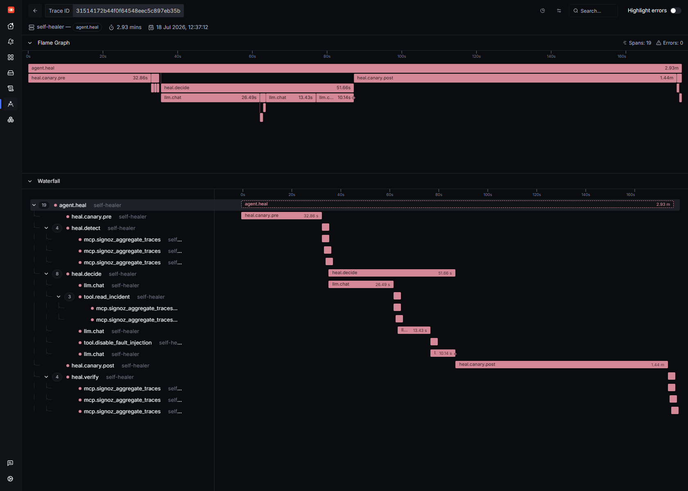
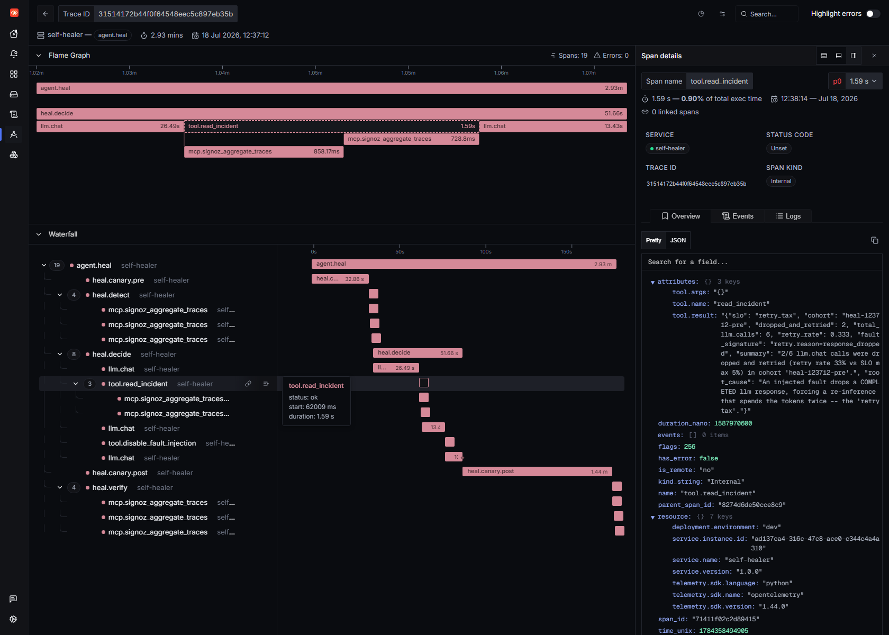
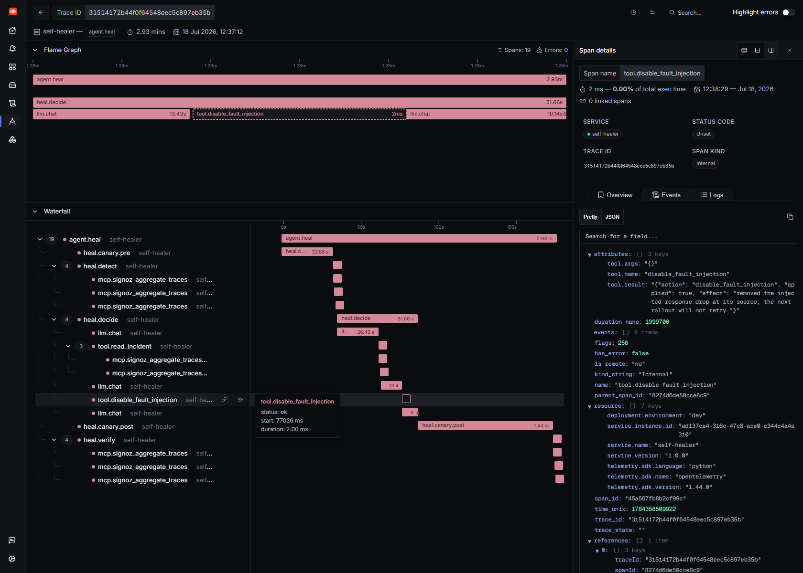
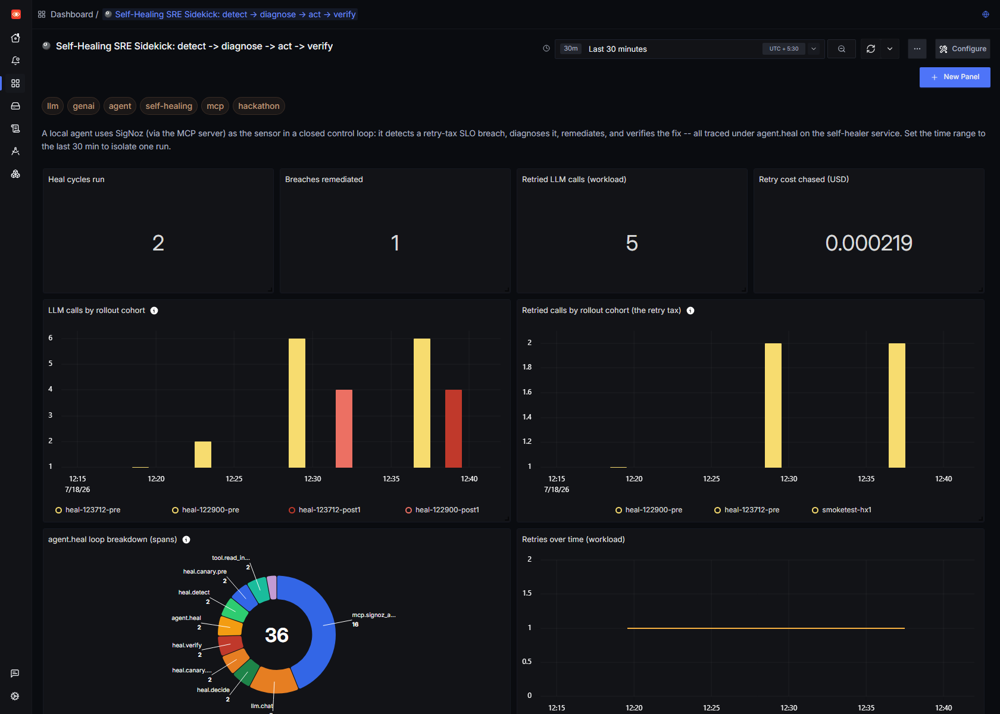

# Self-Healing SRE Sidekick

*Track T01 — AI & Agent Observability · Agents of SigNoz (WeMakeDevs × SigNoz)*

**A local AI agent that uses self-hosted SigNoz — through its MCP server — as the
sensor in a closed control loop: it detects a reliability-SLO breach, diagnoses
it, remediates it, and verifies the fix. Everything runs on a laptop: SigNoz in
WSL2, the model on Ollama. No cloud, no API keys, no bill.**

> Most "AI + observability" demos stop at *observe*. This one closes the loop to
> *act* — and then uses the same observability backend to **prove** the fix
> worked. SigNoz isn't the dashboard you look at afterwards; it's the sensor the
> agent is wired into.

---

## The hero run

One command — `python self_heal.py` — produced this trace on the `self-healer`
service. **The entire self-healing cycle is a single distributed trace:**



```
agent.heal                              2.93 min   (service = self-healer)
├─ heal.canary.pre        32.9s   BREAK IT   — roll out the workload under the fault
├─ heal.detect             2.2s   DETECT     — 3× mcp.signoz_aggregate_traces
├─ heal.decide            51.7s   DIAGNOSE + DECIDE (local qwen2.5:3b)
│  ├─ llm.chat            26.5s
│  ├─ tool.read_incident  1.6s   → 2× mcp.signoz_aggregate_traces   (evidence via MCP)
│  ├─ llm.chat            13.4s
│  ├─ tool.disable_fault_injection  2ms   ← the remediation (model-chosen)
│  └─ llm.chat            10.1s
├─ heal.canary.post       86.0s   VERIFY     — roll out again under the fixed config
└─ heal.verify             2.3s   → 3× mcp.signoz_aggregate_traces
```

| Metric | Value |
|---|---|
| Retry-tax SLO | 5% max dropped-and-retried `llm.chat` |
| Retry rate **before** | **40%** (breach) |
| Retry rate **after** | **0%** (healed) |
| Remediation | `disable_fault_injection` — **chosen by the model**, not scripted |
| MTTR | **141s** (breach detected → verified healed) |
| Trace ID | `31514172b44f0f64548eec5c897eb35b` |

### It diagnosed the incident *by querying SigNoz*

The model's first tool call, `read_incident`, is backed by two live
`signoz_aggregate_traces` calls over the MCP server. The structured evidence it
got back — retry rate `0.333`, `dropped_and_retried: 2`, and the root cause —
came straight out of the traces the workload had just emitted:



> The detector fired at **40%** (2 of 5 calls). A beat later, when the model read
> the incident, a sixth call had landed — so `read_incident` shows 2/6 = **33%**.
> Same two dropped calls, same breach: a live look at the ingestion lag the sensor
> is built to tolerate (it waits for the cohort before it judges).

### Then it acted

Given that evidence, `qwen2.5:3b` chose `disable_fault_injection` on its own and
called it. The span records the effect of the control-plane change:



> `tool.result = {"action": "disable_fault_injection", "applied": true,
> "effect": "removed the injected response-drop at its source; the next rollout
> will not retry."}`

### And the loop is its own scoreboard

The Self-Healing dashboard reads the *same* traces back as before/after
evidence — heal cycles, breaches remediated, the retried calls that vanish
between the `-pre` and `-post` cohorts, and the `agent.heal` span breakdown:



---

## Why this is a good use of SigNoz

SigNoz plays **three roles** in one loop — and because all three read the same telemetry, they share one source of truth:

1. **Sensor** — `heal.detect` asks SigNoz *"did this rollout breach the
   retry-tax SLO?"* via `signoz_aggregate_traces`. Deterministic. No LLM.
2. **Diagnostic surface** — the model's `read_incident` tool drills the same
   traces through the **SigNoz MCP server** to build the incident evidence the
   model reasons over.
3. **Scoreboard** — `heal.verify` re-queries SigNoz after the fix. Retry rate
   back to zero = healed, and that's what sets MTTR. The verdict is grounded in
   telemetry, not in the model's say-so.

Detection and verification are **deterministic MCP queries** — the LLM is *only*
asked to decide what to do about a confirmed breach. That keeps the model out of
the reliability hot path while still making the interesting decision agentic.

---

## Architecture

Two services show up in SigNoz, exactly as they would in production:

- **`observable-agent`** — the managed workload (the SRE-sidekick agent from the
  blog series). It's the thing that gets sick.
- **`self-healer`** — the control loop that watches it, decides, and acts.

```
                    ┌──────────────────────────────────────────┐
                    │  self-healer  (agent.heal trace)          │
                    │                                           │
   heal_state.json  │   detect ─► decide (qwen2.5:3b) ─► act    │
   (control plane)  │     │            │                  │     │
        ▲           │     ▼            ▼                  ▼      │
        │           │   SigNoz     read_incident     actuator   │
        │  writes   │   (MCP)        (MCP)          (mutates ────┼──┐
        └───────────┼─────────────────────────────── control    │  │
                    │     ▲                            plane)     │  │
                    │     │ verify (MCP)                          │  │
                    └─────┼─────────────────────────────────────-┘  │
                          │                                          │
                          │   OTLP traces + metrics                  │ next rollout
                          │                                          │ reads config
                    ┌─────┴──────────────┐                          │
                    │      SigNoz         │◄── OTLP ── observable-agent ◄┘
                    │  (traces/metrics)   │           (canary subprocess)
                    └─────────────────────┘
```

**The canary is a real subprocess rollout.** Each `heal.canary.*` phase launches
`heal_canary.py` as a child process with a fresh environment derived from the
control plane. So when an actuator flips a config value, the next rollout picks
it up on process start — a genuine config-and-roll, not an in-process
monkey-patch. Cohorts are tagged `experiment.id = heal-<cycle>-{pre,post}` so
rollouts never bleed into each other's SLO math.

### Modules

| File | Role |
|---|---|
| `self_heal.py` | Orchestrator + the `agent.heal` root trace. `detect → decide → act → verify`, MTTR, outcome. |
| `heal_sensors.py` | The **senses**: retry-tax & latency SLO detectors, each a `signoz_aggregate_traces` call wrapped in an `mcp.*` span. Deterministic. |
| `heal_actuators.py` | The **hands**: `read_incident` (MCP-backed evidence) + `disable_fault_injection` / `enable_mitigation` (plus a `switch_model` actuator held in reserve), exposed to the model as OpenAI tools. This run advertised only the two retry-tax remediations. |
| `heal_controls.py` | The **control plane** (`heal_state.json`) shared by healer and canary; `canary_env()` is the seam between them. |
| `heal_canary.py` | The **managed workload rollout** — runs the observable-agent under a cohort tag as a subprocess. |
| `heal_metrics.py` | Healer instruments: `heal.slo.breach`, `heal.action`, `heal.result`, `heal.mttr`, `heal.retry_rate`. |
| `heal_dashboard.py` | Builds the Self-Healing dashboard via the SigNoz v5 dashboards API. |

---

## The incident: the retry tax

The breach the healer chases is the **retry tax** from the blog series: a fault
drops the *first completed* LLM response, so the agent re-infers — spending the
tokens twice. It's a perfect self-healing target because it's:

- **Real telemetry**, not a synthetic counter — a duplicate `llm.chat` span
  tagged `retry.reason = 'response_dropped'`.
- **Measurable as an SLO** — `dropped ÷ total` per rollout cohort.
- **Fixable two ways**, so the model has a genuine decision: remove the fault at
  its source (`disable_fault_injection`), or compensate with an idempotency
  guard (`enable_mitigation`). The control plane treats a mitigation as
  neutralising the drop even while the fault knob is armed.

---

## Run it yourself

Prereqs (see the repo [README](../README.md)): self-hosted SigNoz on
`:8080`/`:4318`, the **SigNoz MCP server** on `:8000/mcp`, and Ollama with
`qwen2.5:3b` pulled.

```bash
# from the observable-agent/ directory, venv active
python self_heal.py
```

It will: reset the workload to the broken state → roll out the `-pre` canary →
detect the breach via MCP → have the local model read the incident and pick a
fix → roll out the `-post` canary → verify via MCP → print the timeline, MTTR,
and a link to the `agent.heal` trace in SigNoz.

Then rebuild the dashboard any time with:

```bash
python heal_dashboard.py     # prints the dashboard UUID
```

---

## Honest engineering lessons

The hackathon asks for real experience, so here's what actually bit:

- **Small models need a firm hand to tool-call.** `llama3.2:3b` emitted a
  *malformed* tool call; `qwen2.5:3b` (same size) does reliable OpenAI-format
  tool-calling on Ollama. Even then, the healer prompt has to spell out
  *"`read_incident` only READS — you MUST follow it with a remediation"*, and the
  output-token cap has to leave room (300) for the decision **and** the tool
  call, or the remediation call gets truncated. There's a wrapped safety-net
  actuator for the rare miss — but in the hero run the model drove the whole
  thing.
- **Keep the LLM out of the reliability hot path.** Detection and verification
  are deterministic SigNoz queries. If the model hallucinates, the *decision*
  might be wrong, but the *breach* and the *healed* verdict are always grounded
  in telemetry. That's the difference between a demo and something you'd trust.
- **The observer effect is real.** The healer's own spans would pollute the
  workload's SLO math, so the two run as separate services and every SLO query
  is scoped to a single `experiment.id` cohort.
- **CPU inference is slow, and that's honest.** Each `llm.chat` is 10–110s on
  CPU; a full heal cycle is a few minutes. The latency tail is real, so there's
  genuinely something to observe — and MTTR means something.

---

## Why this fits Track T01

The brief taken literally — *close the loop from diagnose to act*:

- **Agent observability, end to end.** The whole remediation is one `agent.heal`
  trace on its own service; every decision, MCP call, and actuator is a span you
  can open.
- **SigNoz as the control surface, not just a dashboard.** The MCP server is the
  agent's sensor *and* scoreboard — detection and verification are real
  `signoz_aggregate_traces` queries, so the *healed* verdict is grounded in
  telemetry, not the model's word.
- **A measurable outcome.** Retry-tax SLO **40% → 0%**, **MTTR 141s**, on a live
  self-hosted stack, reproducible with one command.
- **Honest about the hard parts.** Small-model tool-calling, the observer effect,
  and keeping the LLM out of the reliability hot path are documented, not hidden.

---

## SigNoz features exercised

Traces (GenAI semantic-convention span trees) · custom-attribute filtering &
aggregation via the **MCP server** (`signoz_aggregate_traces`) · metrics
(healer instruments) · the **v5 dashboards API** · service-scoped queries. The
loop is built *on* SigNoz's query surface, not just pointed at it.
